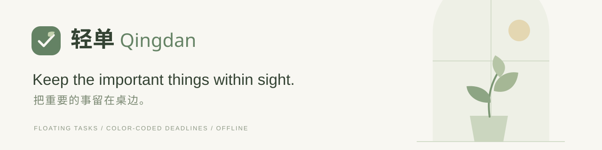
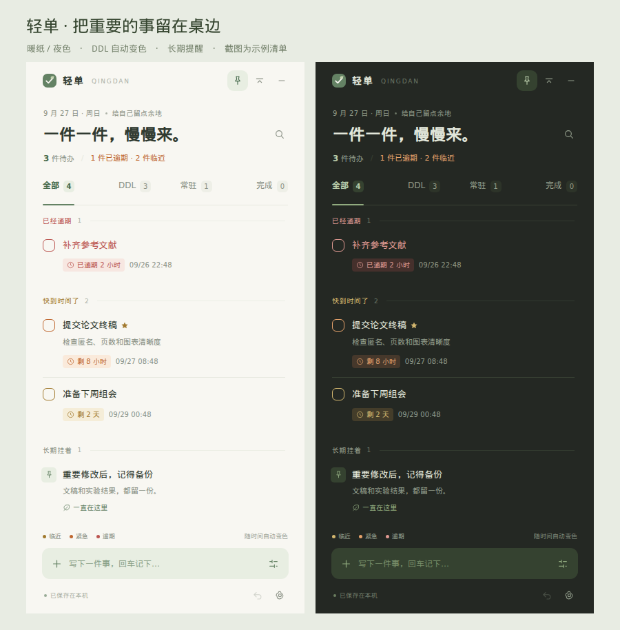
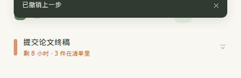

<p align="center"></p>
<p align="center"><a href="README.md">中文</a> · <strong>English</strong></p>
<p align="center">
  <a href="https://github.com/KennyMcSimpson/qingdan/releases/latest"></a>
  <a href="LICENSE"></a>
  
  
</p>
<p align="center">A quiet, floating task list for your Windows desktop.<br />Capture a task, keep a deadline in sight, and leave room for reminders that stay.</p>
<p align="center"><a href="https://github.com/KennyMcSimpson/qingdan/releases/latest"><strong>Download for Windows</strong></a> &nbsp; · &nbsp; <a href="#getting-started">Getting started</a> &nbsp; · &nbsp; <a href="https://github.com/KennyMcSimpson/qingdan/issues">Report an issue</a></p>

<p align="center"></p>
<p align="center"><sub>Actual application screenshots · Example tasks only · The app interface is currently in Chinese</sub></p>

## Keep the important things within sight

| Feature | What it does |
| --- | --- |
| **A floating desktop window** | Move, resize, keep it on top, or collapse it into a small strip. |
| **Deadlines that change color** | Amber when approaching, orange when urgent, red when overdue. |
| **Reminders that stay** | Keep long-term goals and things to remember visible without an expiration date. |
| **Room for the details** | Add notes, flag important tasks, search titles and notes, restore completed tasks. |
| **Easy to put away** | Hide it in the tray and bring it back with `Ctrl + Alt + Q`. |
| **Saved on your computer** | Automatic saves, 30-step undo, JSON backup / restore, daily snapshots. |
| **A comfortable look** | Paper and Night themes, three accent colors and adjustable opacity. |

No account or cloud service. Your list stays on your own computer.

## Getting started

1. Open **[Releases](https://github.com/KennyMcSimpson/qingdan/releases/latest)** and download `Qingdan-1.0.0-windows-x64.zip`.
2. Extract the **entire** archive to a permanent folder.
3. Double-click **`Qingdan.exe`**. Type a task into the bottom input and press Enter.

The runtime is included: **you do not need Node.js or Python** to use the portable app. Keep the files beside the EXE and the `resources` directory together. Copying the EXE alone will not work.

Target platform: **Windows 10 / 11 x64**. The download is about **139 MiB**, including Electron. Your first launch starts with an empty list.

The four tabs are **全部** (All), **DDL** (Deadlines), **常驻** (Persistent reminders), and **完成** (Completed). Click a title to edit; the sliders button beside the bottom input opens the detailed editor. Repository documentation is bilingual; the current app UI is Chinese.

### A little color before time runs out

| State | Default threshold | Appearance |
| --- | --- | --- |
| 🟢 Plenty of time | More than 3 days left | Soft green, remaining time, exact date |
| 🟡 Approaching | More than 24 hours, up to 3 days | Amber |
| 🟠 Urgent | Up to 24 hours left | Orange |
| 🔴 Overdue | Deadline reached or passed | Red, with elapsed time |
| 🌿 Persistent reminder | No deadline | A soft accent color |

Choose an approaching threshold of **1 / 3 / 7 / 14 days** and an urgent threshold of **6 / 12 / 24 hours** in Settings. Urgency wins when thresholds overlap. Colors refresh every 15 seconds while visible and when the window is shown again.

Dates use your computer's local time zone. The default time is 23:59 on the selected date. Deadlines are saved as exact instants and displayed in the local time zone when you travel.

### When you need a little more space

<p align="center"></p>

The compact strip keeps the nearest deadline and its warning color visible. Click it to expand. Persistent reminders stay until you archive them manually.

| Shortcut | Action |
| --- | --- |
| `Ctrl + Alt + Q` | Show / hide the window |
| `Ctrl + N` | Open the detailed editor |
| `Ctrl + F` | Search titles and notes |
| `Ctrl + Z` | Undo the last action; inside inputs, undo typing |
| `Esc` | Close the editor, settings, or search |

## Your data, on your computer

- Data folder: `%APPDATA%\Qingdan`. Open it directly from Settings.
- Every change is saved automatically. The previous write and up to 20 snapshots are retained.
- Export a JSON backup and restore it on another computer. Restore asks for confirmation, backs up the current list first, and can be undone.
- Share the portable app with a friend: **your personal list is not copied with the application folder**.
- Start with Windows is off by default. Closing the window hides it in the tray; use the tray menu or Settings to quit completely.
- Undo covers the most recent 30 changes in this session. Up to 5,000 records, 160 characters per title and 5,000 characters per note are supported.

Notifications work only while the app is running, including while hidden in the tray. They do not wake it after it has been quit or the computer shut down. Windows may suppress system notifications; in-window deadline colors remain available.

## Run from source

Install Node.js 24 and npm, then clone this repository:

```sh
npm ci
npm start
```

Use `npm test` for core tests, or `npm run test:ui` for the full Electron suite in an available desktop session.

See **[CONTRIBUTING.md](CONTRIBUTING.md)** for development and packaging. There are no third-party JavaScript runtime dependencies; Electron and the other dependencies support the desktop environment, development, testing and packaging.

## Verification and releases

The initial version passed **17 core tests and 17 real Electron interaction checks**. The Windows archive uses a checksum-verified official runtime and passed ZIP CRC checks. See [VALIDATION.md](VALIDATION.md) for the exact scope.

Initial UI checks used Electron on Linux. **The application has not yet been exercised on a real Windows 10 / 11 machine.** Tray notifications, startup registration, input methods and multi-monitor DPI still need device feedback. This release is unsigned and has no automatic updater.

[Changelog](CHANGELOG.md) · [Feedback](https://github.com/KennyMcSimpson/qingdan/issues)

## License and acknowledgments

The source, application mark and vector illustrations use the [MIT License](LICENSE). Electron and Chromium notices are included in the portable distribution.

Open-source desktop task tools informed the interaction design. Qingdan's interface, logic and art were independently implemented; see [REFERENCES.md](REFERENCES.md).

<p align="center"><sub>轻一点，把重要的事留在桌边。<br />Keep the important things within sight.</sub></p>
