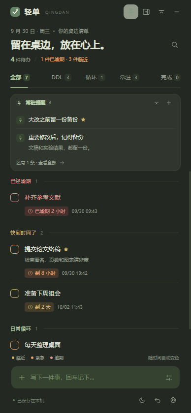
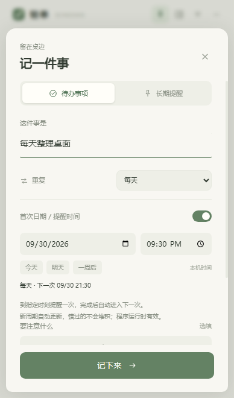

<p align="center"></p>
<p align="center"><strong>中文</strong> · <a href="README.en.md">English</a></p>
<p align="center">
  <a href="https://github.com/KennyMcSimpson/qingdan/releases/latest"></a>
  <a href="LICENSE"></a>
  
  
  <a href="https://github.com/KennyMcSimpson/qingdan/actions/workflows/desktop.yml"></a>
</p>
<p align="center">一个会主动让开工作区的 Windows 悬浮清单。<br />每天的小事按时提醒，常驻叮嘱留在顶部，DDL 临近时自己变色。</p>
<p align="center"><a href="https://github.com/KennyMcSimpson/qingdan/releases/latest"><strong>下载 Windows 便携版</strong></a> &nbsp; · &nbsp; <a href="docs/guide.zh-CN.md">完整使用说明</a> &nbsp; · &nbsp; <a href="https://github.com/KennyMcSimpson/qingdan/issues">反馈问题</a></p>

<p align="center"> &nbsp; </p>
<p align="center"><sub>真实界面截图 · 事项为演示数据 · 应用界面目前为中文</sub></p>

## 重要的事，抬眼就能看见

| 功能 | 怎么用 |
| --- | --- |
| **会让开的悬浮窗** | 切到其他窗口后自动贴边成小标签，点击展开；可关闭自动贴边。 |
| **每日 / 每周循环** | 每天、周一至周五或每周，在指定时刻提醒；完成本次自动进入下一次。 |
| **会变色的 DDL** | 显示剩余时间；临近变琥珀色，紧急变橙色，逾期变红色。 |
| **顶部常驻提醒** | 注意事项固定在顶部可折叠区，默认展示两条，一键查看全部。 |
| **写下细节** | 备注、重要标记、标题和备注搜索、完成后恢复。 |
| **随时收起** | 小条模式、隐藏 15 分钟、系统托盘，按 `Ctrl + Alt + Q` 重新唤回。 |
| **安心保存** | 自动保存到本机，30 步撤销、JSON 导出 / 恢复、每日快照。 |
| **舒服一点** | 暖纸 / 夜色两套主题，三种点缀色，不透明度可调。 |

不需要账号，也没有云端服务。你的清单留在自己的电脑里。

## 开始使用

1. 打开 **[Releases](https://github.com/KennyMcSimpson/qingdan/releases/latest)**，下载 `Qingdan-1.1.0-windows-x64.zip`。
2. 将整个压缩包解压到一个固定文件夹。
3. 双击 **`Qingdan.exe`**。在底部输入一件事，按回车记下来。

运行环境已经包含在包里，**不需要安装 Node.js 或 Python**。请保留 EXE 旁的文件和 `resources` 文件夹，不要只复制一个 EXE。

适用 **Windows 10 / 11 x64**。便携包约 **139 MiB**，包含 Electron 运行环境；首次打开是空清单。

**从 1.0 升级：** 先在设置里导出备份、完全退出旧版，然后把新版完整解压到固定文件夹并运行。清单仍从 `%APPDATA%\Qingdan` 读取，旧待办、备注、完成状态和外观设置会保留；开机启动已开启时，在新版中重新开关一次以更新路径。

### 日常小事，设置一次就好

打开 **循环** 分类，输入一件事并回车。选 **每天 / 工作日 / 每周**，设置首次日期和时间，例如每天 09:00 整理计划、工作日 18:00 记录进度、每周日 20:00 复盘。

到指定时间提醒一次；点完成只完成本次，会保留完成记录并排好下一次。到了新周期，即使上一期没点完成也会自动更新，错过的不会堆积。工作日指周一到周五，不含法定节假日规则。常驻提醒适合一直展示的叮嘱，循环适合需要定时做的事情。

<p align="center"></p>

### 截止时间，会自己变色

| 状态 | 默认范围 | 显示 |
| --- | --- | --- |
| 🟢 还有时间 | 超过 3 天 | 柔和绿色、剩余时间、具体日期 |
| 🟡 临近 | 24 小时以上、3 天以内 | 琥珀色 |
| 🟠 紧急 | 24 小时以内 | 橙色 |
| 🔴 逾期 | 已到期 / 超时 | 红色、已逾期多久 |
| 🌿 长期提醒 | 没有截止时间 | 柔和的主题点缀色 |

设置里可以调整提前 **1 / 3 / 7 / 14 天**预警、提前 **6 / 12 / 24 小时**进入紧急状态。颜色每 15 秒刷新，重新显示窗口时也会更新。日期按本机时区输入，默认截止时刻为当天 23:59。

### 忙的时候，让开工作区

切到其他窗口后，轻单默认在约一秒内贴到最近的屏幕侧边，收成 **46 像素宽的标签**。标签上的数字和颜色提示待办状态，点击展开。正在编辑或使用备份对话框时不会自动收起；设置里可以关闭此行为。

顶部贴边按钮可以立即收起；底部月亮按钮会隐藏 **15 分钟**，到时只恢复侧边标签。期间可随时通过托盘或快捷键唤回。

<p align="center"> &nbsp; </p>

如果想持续看到最近的事项，还可以收成小条，保留最近 DDL 及预警色，点一下展开。常驻提醒不会随时间消失，需要手动归档。

| 快捷键 | 操作 |
| --- | --- |
| `Ctrl + Alt + Q` | 唤回 / 隐藏窗口 |
| `Ctrl + N` | 添加 DDL、备注或长期提醒 |
| `Ctrl + F` | 搜索标题和备注 |
| `Ctrl + Z` | 撤销上一步；文本框内为撤销输入 |
| `Esc` | 关闭编辑 / 设置 / 搜索 |

## 数据留在你手里

- 数据目录：`%APPDATA%\Qingdan`，设置中可以直接打开。
- 每次修改自动保存，并保留上一次写入的副本；最多保留 20 份快照。
- “导出备份”生成 JSON 文件；换电脑后用“恢复备份”继续。
- 可以把程序包发给朋友，**你的清单不会跟着程序文件夹一起复制**。
- 开机启动默认关闭。关闭窗口会收进托盘；彻底退出请用托盘菜单或设置页底部按钮。

系统提醒只在程序运行期间工作；完全退出或关机后不会定时唤醒。Windows 勿扰设置可能影响通知，窗口内的变色仍正常工作。

## 从源码运行

需要 Node.js 24 和 npm。克隆仓库后：

```sh
npm ci
npm start
```

核心测试用 `npm test`。完整窗口测试用 `npm run test:ui`，需要可用的桌面会话。

构建、代码目录和贡献方式见 **[CONTRIBUTING.md](CONTRIBUTING.md)**。没有第三方 JavaScript 运行时依赖；Electron 和其他依赖用于桌面环境、开发、测试及构建。

## 验证与版本

**29 项核心测试、Windows / Linux 各 23 项真实 Electron 操作检查通过。** 覆盖循环日期、提醒去重、旧数据兼容、窗口几何和数据恢复；GitHub Actions 校验官方运行包并构建 Windows 便携版。详细结果和范围见 [VALIDATION.md](VALIDATION.md)。

自动化检查不能代替所有 Windows 设备上的使用反馈，托盘通知策略、开机启动、中文输入法和多显示器 DPI 仍需本机确认。本版本没有商业代码签名或自动更新器。

[更新记录](CHANGELOG.md) · [提交反馈](https://github.com/KennyMcSimpson/qingdan/issues)

## 开源与致谢

源码、应用标记和矢量插画使用 [MIT License](LICENSE)。Electron / Chromium 的许可证随便携包保留。

部分开源桌面待办项目提供了交互参考；本项目独立实现界面、逻辑和美术资源。来源见 [REFERENCES.md](REFERENCES.md)。

<p align="center"><sub>轻一点，把重要的事留在桌边。<br />Keep the important things within sight.</sub></p>
